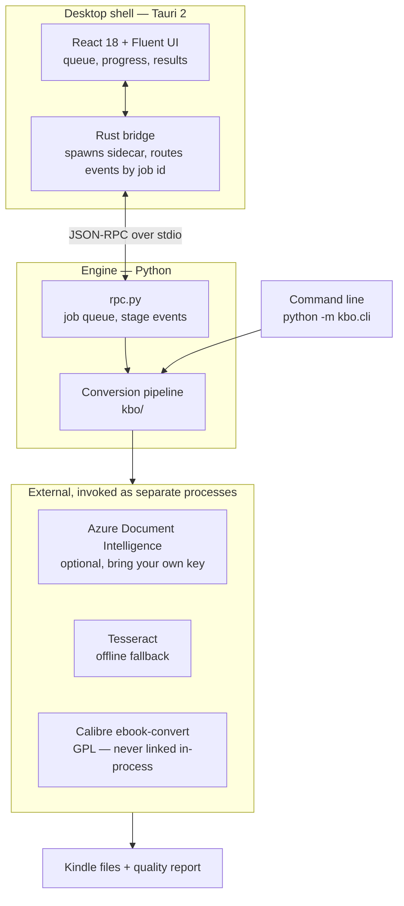
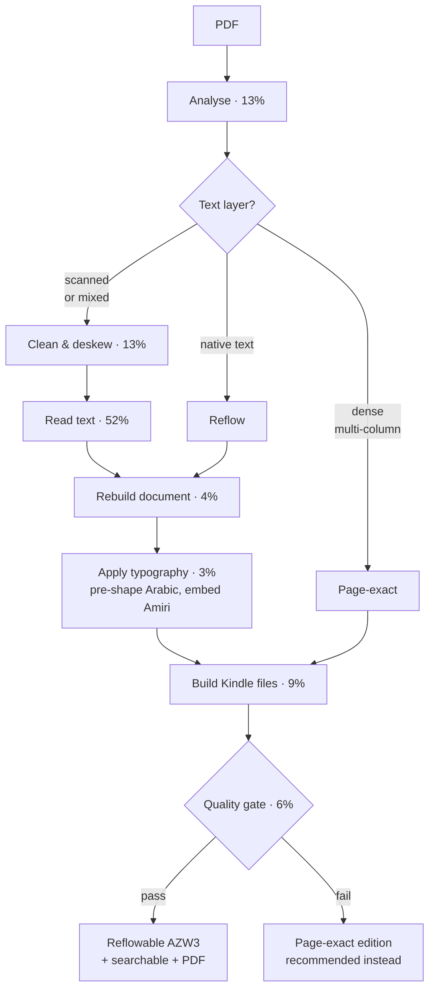
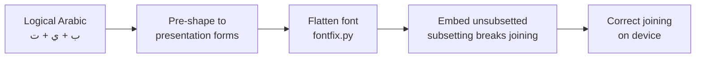

# Warraq

**Arabic PDF → Kindle-ready ebooks, for Windows.**

Turns scanned Arabic books into properly typeset Kindle editions: correct
right-to-left flow, correct letter joining, preserved diacritics, and
professional Amiri typography — with an automated quality report that proves it.

Created by **[Alaaldin97](https://github.com/Alaaldin97)**
· [@Alaaldin97](https://github.com/Alaaldin97)

> Status: **pre-alpha**. The conversion engine is validated and production-grade;
> the desktop shell is under construction.
> See [`docs/ARCHITECTURE.md`](docs/ARCHITECTURE.md) for the full specification.

---

## Repository layout

```
warraq/
├── engine/            Python conversion engine (the product's core asset)
│   ├── kbo/           19 modules — analysis, cleanup, OCR, typography, build, QA
│   ├── assets/        Amiri and the other Arabic font profiles (SIL OFL)
│   ├── tools/         Tesseract language data
│   ├── tests/         regression tests
│   ├── engine.spec    PyInstaller bundle definition
│   └── engine_main.py Frozen entry point
├── shell/             Tauri 2 desktop app
│   ├── src-tauri/     Rust: engine sidecar bridge, credentials, updater
│   └── src/           React 18 + Fluent UI v9
├── docs/              Architecture and decision records
└── installer/         WiX packaging (Phase 5)
```

**Design rule:** the shell contains *zero* conversion logic. Everything that
affects output quality lives in the engine, so the GUI and the CLI can never
diverge.

---

## How it fits together

The desktop app and the command line are two front ends over one engine. They
speak newline-delimited JSON-RPC over stdio, so the GUI can stream live
progress without owning any conversion behaviour.



## The conversion pipeline

Every book is inspected first, then routed down one of three paths. Percentages
are the progress weights the UI uses; reading text dominates the run.



The gate is not decorative: a book that fails shaping validation, font-subsetting
or content-recall checks is **not** shipped as a reflowable ebook. The engine
falls back to the page-exact edition and says so in the report.

## Why Arabic needs the extra step

Kindle firmware does not apply GSUB shaping to embedded fonts, so Arabic set in
a custom face renders as disconnected letters. Warraq pre-shapes text into
presentation forms before embedding — established by testing on real hardware,
not inferred from the spec.



---

## Supported devices

Warraq currently targets the **Kindle Oasis 9th generation (2017)** — 1264×1680
at 300 ppi, 16 grey levels. Output is tuned to that panel: page geometry for the
page-exact edition, reflow margins, and greyscale quantisation all derive from
it.

The AZW3 files it produces are readable on other Kindles, but only the Oasis 9
has been **verified on hardware**, and hardware is where the surprises live —
three separate shaping bugs in this project were invisible until a real device
rendered them.

Device profiles are plain data (`engine/kbo/device.py`):

```python
DEVICES = {
    "kindle_oasis_9": {
        "name": "Kindle Oasis 9th Generation (2017)",
        "screen_px": (1264, 1680),
        "ppi": 300,
        "greyscale_levels": 16,
        "calibre_profile": "kindle_oasis",
        "reflow_margin_px": 26,
    }
}
```

Adding Paperwhite, Scribe, Colorsoft or the base Kindle is a matter of adding an
entry and validating it on the physical device. **If you own one and want it
supported, open an issue** — and if you can run a conversion and photograph the
result, that is exactly the evidence needed to add the profile with confidence.
Demand decides the order.

---

## Prerequisites

### To convert books

| Requirement | Required? | Why | Install |
|---|---|---|---|
| Python 3.12+ | **Yes** | Engine runtime | python.org |
| Calibre 9 | **Yes** | AZW3 generation | `winget install calibre.calibre` |
| Tesseract 5 | **Yes** | Offline OCR — the fallback that makes Azure optional | `winget install UB-Mannheim.TesseractOCR` |
| Azure AI resource | No | Much better Arabic OCR on scanned books | See below |

### To build the desktop shell

| Requirement | Why | Install |
|---|---|---|
| Node 20+ | Shell build | nodejs.org |
| Rust (stable) | Tauri shell | `winget install Rustlang.Rustup` |
| MSVC Build Tools | Rust linker on Windows | `winget install Microsoft.VisualStudio.2022.BuildTools` with the VCTools workload |

```powershell
pip install pymupdf opencv-python-headless numpy fonttools arabic-reshaper pyinstaller pytest
```

### Do I need an Azure subscription?

**No.** Warraq runs fully offline. Azure changes *OCR quality on scanned books*,
and many books need no OCR at all. There are two ways to run it, and both are
tested:

| | **Option A — offline** | **Option B — with Azure** |
|---|---|---|
| Cost | Free | Your own Azure resource, billed to you |
| Setup | Install Tesseract | Add one line to a config file |
| OCR engine | Tesseract (Arabic data bundled) | Azure Document Intelligence, Tesseract as fallback |
| Internet | Not needed | Needed while reading pages |
| Privacy | Nothing leaves your machine | Page images are sent to your Azure resource |
| Quality on scans | Usable | Noticeably better |

Measured on the same scanned Arabic book, same 5 pages:

| | Offline | With Azure |
|---|---|---|
| Mean OCR confidence | 54.9 *(poor)* | **72.4** *(marginal)* |
| Pages flagged low-confidence | 2 | **0** |
| Engine score | Tesseract 24.3 | **Azure 54.9** |
| Runtime | 29s | 40s |

Both produced a valid Kindle file that passed the quality gate. Neither failed.

Note what happened on that book: **both routes fell back to the page-exact
edition**, because even Azure's 72.4 was not confident enough to risk emitting
Arabic text. That is the design working as intended — Warraq preserves the
scanned page rather than shipping corrupted Arabic.

**Which should you choose?**

- Books that already have a text layer → **Option A**. No OCR runs; Azure would
  change nothing.
- Occasional scanned books → **Option A** is fine.
- A library of scanned books, and quality matters → **Option B**.

You can switch at any time. Nothing is baked into the output.

---

## Running the engine

### Option A — offline, no Azure

Nothing to configure. Install Tesseract (see Prerequisites) and convert:

```powershell
cd engine
python -m kbo.cli book.pdf --out out\book --workers 6
```

Warraq reports which engine it used and the confidence it reached, so you can
judge the result rather than guess.

### Option B — with Azure Document Intelligence

You need an Azure subscription and either an **Azure AI Services** or
**Document Intelligence** resource. Warraq never ships a key: the resource is
yours, and Microsoft bills you directly. Check current Azure pricing before
converting a large library — Document Intelligence has a free tier with a
monthly page allowance.

Create `%APPDATA%\Warraq\config.json`:

```json
{ "azureEndpoint": "https://<your-resource>.cognitiveservices.azure.com/" }
```

Authentication uses your signed-in Azure identity — run `az login` once. To use
an API key instead, add `"azureKey": "..."` to the same file.

Verify it is picked up:

```powershell
python -c "from kbo import azure_ocr; print(azure_ocr.status())"
```

`"ready": True` means Azure will be used. `False` means Warraq will fall back to
Tesseract — it will still convert the book.

The environment variables `KBO_AZURE_DI_ENDPOINT` and `KBO_AZURE_DI_KEY`
override the file and are convenient for CI. `KBO_CONFIG` points at a different
config file, which is handy for testing the offline path.

Privacy: in this mode page images are uploaded to **your** Azure resource for
recognition. Nothing is sent anywhere else, and the desktop app shows "Azure
connected" in the status bar whenever this is active.

### More ways to convert

```powershell
cd engine

# one book
python -m kbo.cli book.pdf --out out\book --workers 6

# a folder of books
python -m kbo.batch --workers 6

# JSON-RPC mode (what the desktop shell speaks)
python -m kbo.cli --rpc
```

Arabic books automatically get Amiri, pre-shaped, plus a searchable companion.
No flags required.

### Useful options

| Flag | Default | Purpose |
|---|---|---|
| `--arabic-font` | `amiri` | Typeface profile |
| `--font-mode` | `auto` | `auto` pre-shapes Arabic, leaves English native |
| `--ocr-engine` | `auto` | `azure`, `tesseract`, or auto-select |
| `--make-pdf` | `auto` | Also emit a Kindle-sized PDF |
| `--force-route` | `auto` | `reflow`, `ocr`, `fixed` |
| `--max-pages` | all | Page-limited trial run |

---

## Running the shell

```powershell
cd shell
npm install
npm run tauri dev
```

The shell locates the engine in this order: bundled next to the app → the
PyInstaller build in `engine/dist/` → the Python source in `engine/`.

---

## Building for distribution

```powershell
cd engine
python -m PyInstaller engine.spec --noconfirm   # -> engine/dist/warraq-engine/

cd ..\shell
npm run tauri build
```

**The engine must be built as `--onedir`, never `--onefile`.** A onefile bundle
extracts `python3xx.dll` to `%TEMP%` at launch, which Windows Application
Control blocks on managed corporate devices.

---

## Tests

```powershell
cd engine
python -m pytest tests -q
```

The suite encodes every bug that has ever shipped, most notably:

- Arabic presentation-form handling and visual→logical order recovery
- Ornate Quranic parentheses `﴿ ﴾` are legitimate typography, not breakage
- Amiri must never be subsetted (a subsetted face breaks letter joining)
- Font flattening makes any Arabic font renderable with pre-shaped text
- OCR output must never be re-sorted by Y coordinate (it destroys column order)
- Progress reporting must be monotonic

There is also an **on-device Kindle regression suite** that cannot be automated.
Three separate bugs were only discoverable on real hardware. Run it before every
release.

---

## Quality gate

Every conversion is verified before delivery:

| Check | Failure action |
|---|---|
| Format magic bytes | Fail |
| Metadata read-back | Warn |
| Content coverage vs source | Fail below 70% vocabulary recall |
| Arabic shaping validation | Fail |
| Embedded font not subsetted | Fail |
| RTL direction | Fail |

A failed gate does not mean a failed conversion — the engine automatically
builds the page-exact edition instead and recommends it.

---

## Licence

Warraq is released under the **GNU Affero General Public License v3.0** — see
[`LICENSE`](LICENSE).

**In plain terms.** Anyone may use, study, modify and share Warraq for free,
including commercially. The one condition: if they distribute a modified
version, *or run it as a service other people use over a network*, they must
publish their source code under the same licence. In short — improvements stay
open, and nobody can take this work, close it, and sell it as their own.

You keep full copyright as the author. The licence binds everyone else, not you.

**Why this licence and not MIT.** This is a consequence of the dependency graph
rather than a preference. PyMuPDF, which the engine uses throughout, is
dual-licensed AGPL-3.0 or Artifex commercial. Bundling it means the combined
work must be AGPL-3.0 unless a commercial licence is purchased, so a permissive
licence such as MIT is not available while PyMuPDF is in use.

If you fork Warraq, or run it as a network service, the same obligation applies
to you.

### Third-party components

Full attribution is in [`THIRD-PARTY-NOTICES.md`](THIRD-PARTY-NOTICES.md).

- Arabic fonts (Amiri, Noto Naskh Arabic, Scheherazade New, Lateef, Markazi,
  Reem Kufi) are SIL OFL 1.1; embedding is permitted. Licence text:
  [`licenses/OFL-1.1.txt`](licenses/OFL-1.1.txt).
- Tesseract language data is Apache-2.0.
- **Calibre is GPL v3.** It is invoked as a separate executable and must never
  be linked in-process. See risk R4 in the architecture document.
- No DRM circumvention exists anywhere in this codebase, by design.

---

## Contributing

Contributions are welcome. Please read
[`CONTRIBUTING.md`](CONTRIBUTING.md) first — especially the rules on verifying
Arabic rendering, which is where most subtle bugs hide.

Every pull request is reviewed and merged by the project owner. Open an issue
to discuss anything substantial before writing code.

Please do not commit books: scanned works are usually still in copyright.

---

## Author

**Alaaldin97** — [GitHub](https://github.com/Alaaldin97) ·
[GitHub](https://github.com/Alaaldin97)

Warraq (وَرَّاق) is the classical Arabic word for a copyist and bookseller —
the craftsman who reproduced books by hand so they could be read.

Copyright © 2026 Alaaldin97. Licensed under AGPL-3.0.
