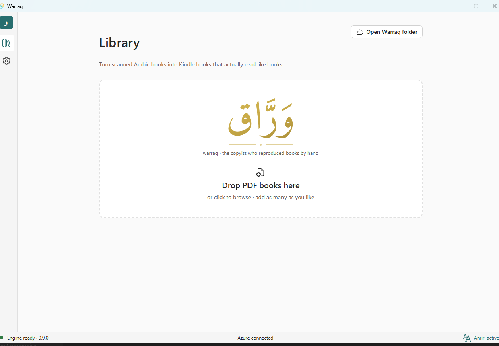
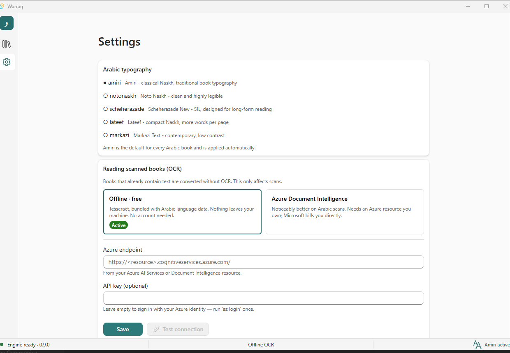
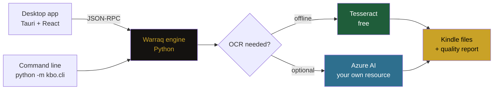
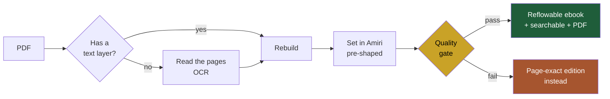
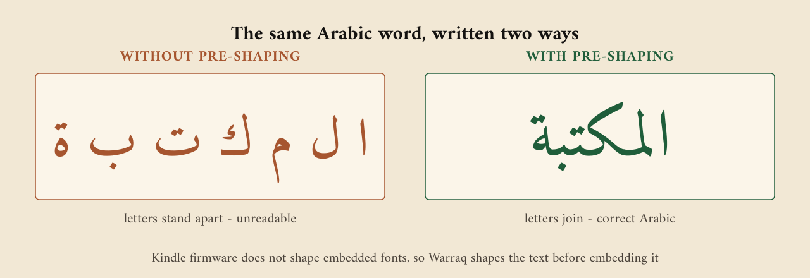

<p align="center">
  
</p>

<p align="center">
  <a href="#setting-up--the-free-path"></a>
  <a href="#setting-up--connecting-your-own-azure"></a>
  
  <a href="LICENSE"></a>
  
</p>

---

**Arabic PDF → Kindle-ready ebooks, for Windows.**

Turns scanned Arabic books into properly typeset Kindle editions: correct
right-to-left flow, correct letter joining, and professional Amiri typography —
with an automated quality report that proves it.

Created by **[Alaaldin Ahmed](https://www.linkedin.com/in/alaaldin-ahmed/)** · [@Alaaldin97](https://github.com/Alaaldin97)

> Status: **pre-alpha**. The conversion engine is validated and production-grade.
> The desktop shell runs and handles conversion, settings and OCR mode switching;
> packaging and the installer are not done yet.
> See [`docs/ARCHITECTURE.md`](docs/ARCHITECTURE.md) for the full specification.

---

## The app

<p align="center">
  
</p>

Drop in a stack of PDFs and leave it. Each book is inspected, routed, converted
and checked on its own, and the status bar tells you which OCR engine is live
and which Arabic typeface is being applied.

<p align="center">
  
</p>

The OCR choice is two clicks and reversible. **Offline is the default** — free,
no account, nothing leaves the machine. Point it at your own Azure resource only
if you want the extra accuracy on difficult scans; **Test connection** performs a
real recognition call rather than just checking that a string was saved.

---

## Repository layout

```
warraq/
├── engine/            Python conversion engine (the product's core asset)
│   ├── kbo/           18 modules — analysis, cleanup, OCR, typography, build, QA
│   ├── assets/        Amiri and the other Arabic font profiles (SIL OFL)
│   ├── tools/         Tesseract language data
│   ├── tests/         regression tests
│   ├── engine.spec    PyInstaller bundle definition
│   └── engine_main.py Frozen entry point
├── shell/             Tauri 2 desktop app
│   ├── src-tauri/     Rust: engine sidecar bridge, credentials, updater
│   └── src/           React 18 + Fluent UI v9
├── docs/              Architecture and decision records
└── installer/         WiX packaging — planned, not yet started (Phase 5)
```

---

## How it fits together

The desktop app and the command line are two front ends over one engine, so the
GUI and the CLI can never disagree about output quality.



**Design rule:** the shell contains *zero* conversion logic. Everything that
affects output quality lives in the engine.

## The conversion pipeline

Every book is inspected first, then sent down whichever path suits it. Most of
the time is spent reading text.



The gate is not decorative. A book that fails shaping validation, font
subsetting or content-recall checks is **not** shipped as a reflowable ebook —
Warraq falls back to the page-exact edition and says so in the report. It would
rather give you a photograph of the page than corrupted Arabic.

## Why Arabic needs the extra step

<p align="center">
  
</p>

Arabic letters change shape depending on their neighbours. Kindle firmware does
not apply that shaping to an **embedded** font, so Arabic set in a custom
typeface arrives as a row of disconnected letters — the left panel above.

Warraq converts the text into its final presentation forms *before* embedding,
so the device has no shaping left to do. That is the right panel, and it is what
lands on your Kindle.

This was established by testing on real hardware, not inferred from the spec.
Two consequences are worth knowing:

- Pre-shaped text cannot be searched with the plain Arabic keyboard, so every
  book also ships a **searchable companion** file that keeps normal Unicode.
  Read the pre-shaped one; keep the companion for search and dictionary lookup.
- **Harakat are currently dropped from the pre-shaped edition.** The reshaper
  removes them by default, so a fully vocalised text (وَرَّاق) reaches the main
  AZW3 as وراق. The searchable companion keeps them, because it is not
  pre-shaped. Restoring them means placing every mark by GPOS on a device that
  may not honour it for embedded fonts — that needs testing on real hardware
  before it is claimed to work. Tracked as a known limitation, not fixed.

---

## Supported devices

Warraq currently targets the **Kindle Oasis 9th generation (2017)** — 1264×1680
at 300 ppi, 16 grey levels. Output is tuned to that panel: page geometry for the
page-exact edition, reflow margins, and greyscale quantisation all derive from
it.

The AZW3 files it produces are readable on other Kindles, but only the Oasis 9
has been **verified on hardware**, and hardware is where the surprises live —
three separate shaping bugs in this project were invisible until a real device
rendered them.

Device profiles are plain data (`engine/kbo/device.py`):

```python
DEVICES = {
    "kindle_oasis_9": {
        "name": "Kindle Oasis 9th Generation (2017)",
        "screen_px": (1264, 1680),
        "ppi": 300,
        "greyscale_levels": 16,
        "calibre_profile": "kindle_oasis",
        "reflow_margin_px": 26,
    }
}
```

Adding Paperwhite, Scribe, Colorsoft or the base Kindle is a matter of adding an
entry and validating it on the physical device. **If you own one and want it
supported, open an issue** — and if you can run a conversion and photograph the
result, that is exactly the evidence needed to add the profile with confidence.
Demand decides the order.

---

## Prerequisites

### To convert books

| Requirement | Required? | Why | Install |
|---|---|---|---|
| Python 3.12+ | **Yes** | Engine runtime | python.org |
| Calibre 9 | **Yes** | AZW3 generation | `winget install calibre.calibre` |
| Tesseract 5 | **Yes** | Offline OCR — the fallback that makes Azure optional | `winget install UB-Mannheim.TesseractOCR` |
| Azure AI resource | No | Better Arabic OCR on scanned books | [See below](#setting-up--connecting-your-own-azure) |

Tesseract is required even if you plan to use Azure: it is the fallback that runs
when Azure is unreachable, unconfigured, or out of quota. Warraq expects it at
`C:\Program Files\Tesseract-OCR\tesseract.exe` and does not search `PATH` — see
[the free path setup](#setting-up--the-free-path) if yours lives elsewhere.

Verified on Python 3.14.5, Calibre 9.13.0 and Tesseract 5.4.0.

### To build the desktop shell

| Requirement | Why | Install |
|---|---|---|
| Node 20+ | Shell build | nodejs.org |
| Rust (stable) | Tauri shell | `winget install Rustlang.Rustup` |
| MSVC Build Tools | Rust linker on Windows | `winget install Microsoft.VisualStudio.2022.BuildTools` with the VCTools workload |

```powershell
cd engine
pip install -r requirements.txt -r requirements-dev.txt
```

### Do I need an Azure subscription?

**No.** Warraq runs fully offline. Azure changes *OCR quality on scanned books*,
and many books need no OCR at all. There are two ways to run it, and both are
tested:

| | **Option A — offline** | **Option B — with Azure** |
|---|---|---|
| Cost | Free, forever | Your own Azure resource, billed to you per page |
| Setup | Install Tesseract | Paste an endpoint into Settings |
| Account needed | None | Azure subscription |
| OCR engine | Tesseract (Arabic data bundled) | Azure Document Intelligence, Tesseract as fallback |
| Internet | Not needed | Needed while reading pages |
| Privacy | Nothing leaves your machine | Page images are sent to your Azure resource |
| Quality on scans | Good | Better — fewer unreadable pages |

Switching is a two-click change in Settings and takes effect on the next book.
Nothing is baked into files you have already converted, so you can convert one
book each way and compare.

Measured 27 Aug 2026 on the same scanned Arabic book — a 288-page scan of an
Arabic literary work, first 30 pages, identical settings, only `--ocr-engine`
changed:

| | Offline (Tesseract) | With Azure |
|---|---|---|
| Mean OCR confidence | 78.9 *(good)* | **95.3** *(good)* |
| Pages too weak to trust, kept as images | 4 | **0** |
| Text blocks recovered | 142 | **176** |
| Token match vs source | 97% | **100%** |
| Quality gate | PASS | PASS |
| Runtime, 30 pages | 102.7s | 103.1s |

Both passed the gate and both shipped the **reflowable** AZW3 — the real ebook,
not the page-exact fallback. Offline is a genuinely usable result, not a
consolation prize.

Where Azure earns its cost is the margin: it recovered 34 more text blocks and
left **zero** pages unreadable, where Tesseract gave up on 4 of 30 and preserved
them as images. Over a 288-page book that is the difference between a book you
can read end to end and one with gaps.

Two things worth noticing:

- **Azure was not slower.** Roughly equal wall time. Tesseract spends its time
  computing locally; Azure spends it uploading. Do not choose offline for speed.
- **Confidence is not accuracy.** These are the engine's own confidence scores.
  They track quality well in practice, but the conversion report is what tells
  you whether the book is actually good — read it.

For reference, the full 288-page book through Azure scored **95.7** confidence,
quality score 92, gate PASS, with shaping validated across 63,950 words.

**Which should you choose?**

- Books that already have a text layer → **Option A**. No OCR runs at all; Azure
  would change nothing and cost nothing.
- Occasional scanned books → **Option A**. 78.9 confidence and a passing gate is
  a real ebook, not a compromise.
- Clean modern scans → **Option A**. Tesseract handles these well.
- Old, faint, or badly-scanned Arabic print → **Option B**. This is where the
  4-unreadable-pages-vs-0 gap shows up.
- A library of scanned books where you will not check each one → **Option B**.

Start with Option A. Convert one book, read the conversion report, and only add
Azure if the report tells you it is needed.

---

## Setting up — the free path

Warraq is free and fully offline by default. There is no account, no key, and no
trial. This section is everything you need.

**1. Install the three prerequisites**

```powershell
winget install Python.Python.3.12
winget install calibre.calibre
winget install UB-Mannheim.TesseractOCR
```

**2. Install the Python dependencies**

```powershell
cd engine
pip install -r requirements.txt
```

Add the development extras if you intend to run the tests or build the frozen
sidecar:

```powershell
pip install -r requirements.txt -r requirements-dev.txt
```

**3. Check Tesseract landed where Warraq looks for it**

This is the one step that catches people out. Warraq does **not** search your
`PATH`. It looks at a fixed location:

```
C:\Program Files\Tesseract-OCR\tesseract.exe
```

Verify it:

```powershell
Test-Path "C:\Program Files\Tesseract-OCR\tesseract.exe"
```

If that prints `False` — common if you installed via Chocolatey, Scoop, or chose
a custom folder — point Warraq at it instead of reinstalling:

```powershell
$env:KBO_TESSERACT = "D:\tools\tesseract\tesseract.exe"
```

Set it permanently with `setx KBO_TESSERACT "D:\..."` so it survives a reboot.

**You do not need to install Arabic language data.** Warraq bundles its own
`ara.traineddata` in `engine/tools/tessdata` and points Tesseract at it. A stock
Tesseract install only ships `eng` and `osd`, and that is fine — Warraq overrides
`TESSDATA_PREFIX` for the pages it processes. (`KBO_TESSDATA` overrides the
bundled folder if you want your own.)

**4. Convert a book**

```powershell
cd engine
python -m kbo.cli book.pdf --out out\book --workers 6
```

That is the whole setup. In the desktop app, the **Offline · free** card in
Settings is selected by default and shows **Active** — nothing to configure.

---

## Setting up — connecting your own Azure

Optional. This improves OCR on **scanned** books only. If your PDFs already have
a text layer, this changes nothing and you should skip it.

Warraq never ships a key. The resource is yours, in your subscription, and
Microsoft bills you directly.

**1. Create the resource**

In the [Azure portal](https://portal.azure.com), create either an **Azure AI
Services** or a **Document Intelligence** resource. Any region works; pick one
near you to cut upload time.

Or from the CLI:

```powershell
az group create --name warraq-rg --location westeurope
az cognitiveservices account create `
  --name my-warraq-di --resource-group warraq-rg `
  --kind FormRecognizer --sku F0 --location westeurope
```

`--sku F0` is the free tier. `S0` is pay-as-you-go — check current
[Document Intelligence pricing](https://azure.microsoft.com/pricing/details/ai-document-intelligence/)
before running a large library, and see the cost note below.

**2. Copy the endpoint.** It looks like:

```
https://my-warraq-di.cognitiveservices.azure.com/
```

**3a. Connect it — in the desktop app (recommended)**

1. Open **Settings → Reading scanned books (OCR)**
2. Click the **Azure Document Intelligence** card
3. Paste your endpoint into **Azure endpoint** — the scheme is optional, so
   `my-warraq-di.cognitiveservices.azure.com` works too
4. Leave **API key** empty to sign in with your own Azure identity (run
   `az login` once), or paste a key if you prefer
5. Click **Test connection** — this sends one small page and reports what
   actually happened, including the specific reason if it fails
6. Click **Save**

The card shows **Active** and the status bar reads **Azure connected**. To go
back to free mode, click **Disconnect** — that clears the endpoint and key, and
the Offline card becomes Active again. Nothing is baked into files you already
converted.

The interface never receives your key back — it only learns whether one is
stored. Note where it is stored, though:

> ⚠️ **An API key you save is written in plaintext** to
> `%APPDATA%\Warraq\config.json`. It is not yet protected by DPAPI or Windows
> Credential Manager. If that matters to you, leave the key field empty and
> authenticate with `az login` instead — Entra tokens are held per-session and
> never written to disk. For CI, use `KBO_AZURE_DI_KEY`.

**3b. Connect it — on the command line**

Create `%APPDATA%\Warraq\config.json`:

```json
{ "azureEndpoint": "https://my-warraq-di.cognitiveservices.azure.com/" }
```

Authentication uses your signed-in Azure identity — run `az login` once. To use
a key instead, add `"azureKey": "..."` to the same file.

Confirm Warraq picked it up:

```powershell
cd engine
python -c "from kbo import azure_ocr; print(azure_ocr.status())"
```

`ready: True` means Azure will be used. `False` means Warraq falls back to
Tesseract — **your book still converts**, just offline.

**4. Convert**

```powershell
python -m kbo.cli book.pdf --out out\book --workers 6
```

Warraq prints which engine it used and the confidence it reached. Force either
engine with `--ocr-engine azure` or `--ocr-engine tesseract`.

### What it costs

Document Intelligence bills per page, and Warraq sends **one page image per
page of the book** — so a 288-page scan is 288 billed pages. The free F0 tier
has a monthly page allowance that is enough to try a book or two; a library will
exceed it. Check current pricing before a bulk run. Warraq cannot see your bill
and will not warn you.

Books with an existing text layer are routed to reflow and **never** hit Azure,
so they cost nothing regardless of this setting.

### What gets sent

In Azure mode, cleaned page **images** are uploaded to your own resource for
recognition. Nothing is sent anywhere else — not to me, not to any Warraq
service, which does not exist. In offline mode nothing leaves your machine at
all.

If a book is confidential, use offline mode.

### For CI and scripting

| Variable | Purpose |
|---|---|
| `KBO_AZURE_DI_ENDPOINT` | Endpoint; overrides the config file |
| `KBO_AZURE_DI_KEY` | API key; overrides the config file |
| `KBO_CONFIG` | Point at a different config file — handy for forcing the offline path in tests |
| `KBO_TESSERACT` | Path to `tesseract.exe` if it is not in the default location |
| `KBO_TESSDATA` | Alternative tessdata folder |

### When Azure is configured but something is wrong

Warraq is designed not to fail the conversion over this. If the endpoint is
unreachable, the credential has expired, or the quota is exhausted, it logs a
warning and falls back to Tesseract. You get a book either way — check the
reported engine and confidence to see which path ran.

In the app, **Test connection** is the fastest way to find out why: it performs a
real recognition call rather than just checking that a string was saved.

---

## More ways to convert

```powershell
cd engine

# one book
python -m kbo.cli book.pdf --out out\book --workers 6

# a folder of books
python -m kbo.batch --workers 6

# JSON-RPC mode (what the desktop shell speaks)
python -m kbo.cli --rpc
```

Arabic books automatically get Amiri, pre-shaped, plus a searchable companion.
No flags required.

### Useful options

| Flag | Default | Purpose |
|---|---|---|
| `--arabic-font` | `amiri` | Typeface profile |
| `--font-mode` | `auto` | `auto` pre-shapes Arabic, leaves English native |
| `--ocr-engine` | `auto` | `azure`, `tesseract`, or auto-select |
| `--make-pdf` | `auto` | Also emit a Kindle-sized PDF |
| `--force-route` | `auto` | `reflow`, `ocr`, `fixed` |
| `--max-pages` | all | Page-limited trial run |

Use `--max-pages 20` to trial a book before committing to a full run — it is the
cheapest way to see which route and engine a book will get, and in Azure mode it
caps what you are billed while testing.

---

## Troubleshooting

**"Tesseract not found" or OCR silently produces nothing**

Warraq looks only at `C:\Program Files\Tesseract-OCR\tesseract.exe`. It does not
search `PATH`. Confirm with `Test-Path`, and if it is elsewhere set
`KBO_TESSERACT` to the full path to `tesseract.exe`.

**Arabic comes out as garbage or Latin letters**

Tesseract is reading with the wrong language data. Warraq bundles
`ara.traineddata` and sets `TESSDATA_PREFIX` itself, so this usually means
`KBO_TESSDATA` is set to a folder that has no `ara.traineddata`. Unset it.

**Letters appear disconnected on the Kindle**

You are looking at the searchable companion, not the main file. Kindle firmware
does not shape embedded fonts, which is the whole reason for pre-shaping. Use
`..._AZW3.azw3` for reading; the `..._Searchable.azw3` trades correct joining for
working search and dictionary lookup.

**Azure is configured but Tesseract ran anyway**

By design — Warraq falls back rather than failing your conversion. Check the run
log for a warning. Common causes: expired `az login`, quota exhausted, wrong
region in the endpoint, or a network block. In the app, **Test connection**
performs a real recognition call and reports the actual reason.

**"Azure connected" but conversions still look offline**

Books with an existing text layer are routed to reflow and never invoke OCR at
all. Check the reported route — `reflow` means no OCR ran and that is correct.

**Push to GitHub rejected over `.github/workflows/`**

A GitHub token without the `workflow` scope cannot create or update workflow
files. Run `gh auth refresh -h github.com -s workflow`. If Git Credential Manager
keeps serving the old token afterwards, bypass it once:

```powershell
git -c credential.helper= -c credential.helper="!gh auth git-credential" push
```

**Arabic filenames crash the CLI**

Fixed — the CLI now forces UTF-8 output and degrades gracefully on consoles
stuck in a legacy code page. If you still hit it, report the console code page
(`chcp`) in the issue.

---

## Running the shell

```powershell
cd shell
npm install
npm run tauri dev
```

The shell locates the engine in this order:

1. A bundled `engine\warraq-engine.exe` next to the executable — how a shipped
   install runs
2. **In debug builds only:** the Python source in `engine/`
3. The PyInstaller build in `engine/dist/`
4. The Python source in `engine/`

Debug builds deliberately prefer the source over `engine/dist/`. A stale frozen
build silently shadowing edited source is a genuinely expensive bug to chase, so
during development the source always wins.

---

## Building for distribution

```powershell
cd engine
python -m PyInstaller engine.spec --noconfirm   # -> engine/dist/warraq-engine/

cd ..\shell
npm run tauri build
```

**The engine must be built as `--onedir`, never `--onefile`.** A onefile bundle
extracts `python3xx.dll` to `%TEMP%` at launch, which Windows Application
Control blocks on managed corporate devices.

---

## Tests

```powershell
cd engine
python -m pytest tests -q
```

The suite encodes every bug that has ever shipped, most notably:

- Arabic presentation-form handling and visual→logical order recovery
- Ornate Quranic parentheses `﴿ ﴾` are legitimate typography, not breakage
- Amiri must never be subsetted (a subsetted face breaks letter joining)
- Font flattening makes any Arabic font renderable with pre-shaped text
- OCR output must never be re-sorted by Y coordinate (it destroys column order)
- Progress reporting must be monotonic

There is also an **on-device Kindle regression suite** that cannot be automated.
Three separate bugs were only discoverable on real hardware. Run it before every
release.

---

## Quality gate

Every conversion is verified before delivery:

| Check | Failure action |
|---|---|
| Format magic bytes | Fail |
| Metadata read-back | Warn |
| Content coverage vs source | Fail below 70% vocabulary recall |
| Arabic shaping validation | Fail |
| Embedded font not subsetted | Fail |
| RTL direction | Fail |

A failed gate does not mean a failed conversion — the engine automatically
builds the page-exact edition instead and recommends it.

---

## Licence

Warraq is released under the **GNU Affero General Public License v3.0** — see
[`LICENSE`](LICENSE).

**In plain terms.** Anyone may use, study, modify and share Warraq for free,
including commercially. The one condition: if they distribute a modified
version, *or run it as a service other people use over a network*, they must
publish their source code under the same licence. In short — improvements stay
open, and nobody can take this work, close it, and sell it as their own.

You keep full copyright as the author. The licence binds everyone else, not you.

**Why this licence and not MIT.** This is a consequence of the dependency graph
rather than a preference. PyMuPDF, which the engine uses throughout, is
dual-licensed AGPL-3.0 or Artifex commercial. Bundling it means the combined
work must be AGPL-3.0 unless a commercial licence is purchased, so a permissive
licence such as MIT is not available while PyMuPDF is in use.

If you fork Warraq, or run it as a network service, the same obligation applies
to you.

### Third-party components

Full attribution is in [`THIRD-PARTY-NOTICES.md`](THIRD-PARTY-NOTICES.md).

- Arabic fonts (Amiri, Noto Naskh Arabic, Scheherazade New, Lateef, Markazi,
  Reem Kufi) are SIL OFL 1.1; embedding is permitted. Licence text:
  [`licenses/OFL-1.1.txt`](licenses/OFL-1.1.txt).
- Tesseract language data is Apache-2.0.
- **Calibre is GPL v3.** It is invoked as a separate executable and must never
  be linked in-process. See risk R4 in the architecture document.
- No DRM circumvention exists anywhere in this codebase, by design.

---

## Contributing

Contributions are welcome. Please read
[`CONTRIBUTING.md`](CONTRIBUTING.md) first — especially the rules on verifying
Arabic rendering, which is where most subtle bugs hide.

Every pull request is reviewed and merged by the project owner. Open an issue
to discuss anything substantial before writing code.

Please do not commit books: scanned works are usually still in copyright.

---

## About

Warraq (وَرَّاق) is the classical Arabic word for a copyist and bookseller —
the craftsman who reproduced books by hand so they could be read.

Built and maintained by **[Alaaldin Ahmed](https://www.linkedin.com/in/alaaldin-ahmed/)** · [@Alaaldin97](https://github.com/Alaaldin97)

Copyright © 2026 Alaaldin Ahmed. Licensed under AGPL-3.0.
