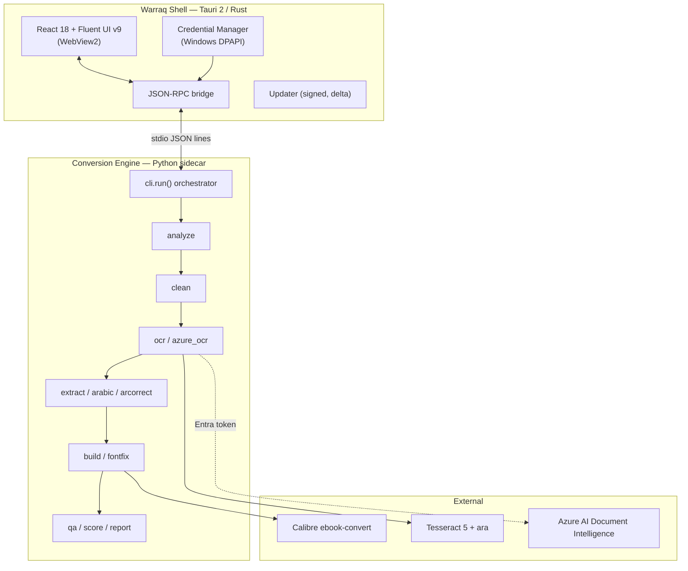
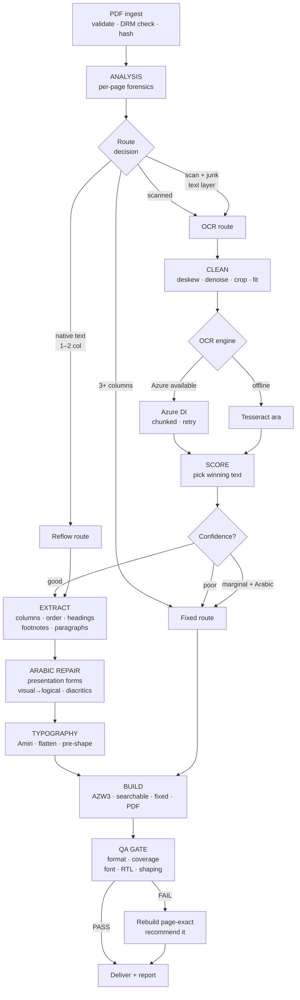

# Warraq — Product Architecture & Design Specification

**Arabic PDF → Kindle-ready ebooks, for Windows.**

Version 1.0 · Architecture baseline · 26 August 2026
Status: **Approved for build** — pending stakeholder sign-off on §10

> **Name rationale.** *Warrāq* (وَرَّاق) — the classical Arabic word for the
> papermakers, copyists and booksellers who preserved the manuscript tradition.
> The product does exactly this: it takes a decaying scanned book and reissues
> it faithfully in a modern reading form. Short, pronounceable in both
> languages, trademark-viable, and it says what it does.

---

## 1. Executive Summary

### 1.1 What already exists

A **fully working, empirically validated conversion engine** — 3,396 lines of
Python across 18 modules. This is not a proof of concept. It has processed three
real books end to end and passes its own automated quality gate:

| Book | Pages | Type | Route | OCR engine | Confidence | QA gate | Time |
|---|---|---|---|---|---|---|---|
| مع الناس — علي الطنطاوي | 225 | Arabic, scanned | OCR → reflow | Azure DI | 95.0 | **PASS** | 587 s |
| The Adventures of Sherlock Holmes | 271 | English, native text | Reflow | — | — | **PASS** | 59 s |
| Western Story Magazine (1922) | 160 | English, scanned + junk layer | OCR → reflow | Tesseract | 87.5 | **PASS** | 139 s |

### 1.2 The strategic decision

**The engine is the asset. The product is a shell around it.**

The engine depends on PyMuPDF, OpenCV, NumPy, fontTools and arabic-reshaper.
Three have **no viable .NET equivalent** — in particular `fontTools`, which the
product uses to rewrite Arabic font binaries (§6.6). A C#/WinUI rewrite would
mean re-implementing OpenType GSUB table flattening from scratch: a multi-month,
high-risk project with no user-visible benefit.

**Therefore: keep the Python engine verbatim as a sidecar process, and build a
native-feeling Windows shell that drives it over a JSON-RPC contract.**

This is the most important architectural decision in this document, and it
de-risks everything downstream.

### 1.3 Recommended stack (detail in §10)

**Tauri 2 + React 18 + Fluent UI v9**, with the Python engine shipped as a
PyInstaller sidecar. Runner-up: WinUI 3. Rejected: Electron, WPF, MAUI.

### 1.4 Three hard-won truths the product must never regress

Discovered through failure during prototyping. Encoded as automated tests, not
tribal knowledge.

1. **Never subset an Arabic font.** Calibre's subsetter does not follow the GSUB
   closure for contextual forms. A subsetted Amiri drops initial/medial/final
   glyphs and letters render disconnected on-device.
2. **The Kindle Oasis does not shape embedded fonts.** Real Unicode + embedded
   Amiri renders as disconnected letters. The only way to ship a custom Arabic
   face is to **pre-shape** text into presentation forms. Verified on hardware
   across three build variants.
3. **Azure Document Intelligence beats Tesseract decisively on Arabic** — 95.0
   vs 82.7 confidence, and a **70× reduction in junk characters**. Tesseract
   remains the offline fallback, never the default when Azure is reachable.

### 1.5 Commercial framing

| | |
|---|---|
| **Category** | Prosumer document-conversion utility |
| **Wedge** | Arabic typography quality — the thing every competitor gets wrong |
| **Moat** | The font-flattening engine (§6.6) and on-device-verified pre-shaping. Both non-obvious; both required hardware testing to discover. |
| **Model** | One-time licence + BYO Azure key; or subscription with pooled OCR credits |
| **Beachhead** | Arabic-reading Kindle owners, Islamic-studies and Arabic-literature academics, digital-library projects |

---

## 2. Product Vision

### 2.1 Positioning statement

> For Arabic readers who own a Kindle and have a library of scanned PDF books
> that are painful to read on it, **Warraq** turns those PDFs into properly
> typeset, Kindle-native ebooks in one drag-and-drop. Unlike Calibre, k2pdfopt
> or online converters, Warraq is built Arabic-first — correct right-to-left
> flow, correct letter joining, preserved diacritics, professional Amiri
> typography — and it proves the result with an automated quality report instead
> of asking you to hope.

### 2.2 Design principles

1. **The default must be excellent.** A user who never opens Settings gets the
   best possible output: Amiri, Azure OCR, dual-output packaging — automatic.
2. **Show the work, hide the machinery.** Surface *quality* (confidence,
   validation, review pages). Never surface *plumbing* (PSM modes, greyscale
   quantisation, GSUB tables).
3. **Never silently degrade.** If OCR confidence is poor, preserve the page
   image rather than emit corrupted Arabic — and say so.
4. **Never lie about a format.** If genuine KFX cannot be produced, say so.
   Never rename AZW3 to `.kfx`.
5. **Respect the user's material.** No DRM circumvention. No cloud upload
   without explicit, informed consent.

### 2.3 Non-goals for v1

macOS/Linux · in-app content editing · library management (Calibre owns this) ·
handwritten-manuscript OCR.

---

## 3. User Personas

### 3.1 Primary — "Alaaldin", the Arabic reader *(design target)*

Professional, bilingual, owns a Kindle Oasis. 50–200 Arabic PDFs collected over
years, mostly Foulabook/archive.org scans of 20th-century print. Reads for
pleasure and study. **Technical enough to install software, unwilling to babysit
a CLI.** Cares intensely about typography; rejects output where letters don't
join or diacritics vanish.

- **Job:** "Put this book on my Kindle so it reads like a real book."
- **Success:** opens it on-device, reads, doesn't notice the software.
- **Failure that loses him:** disconnected Arabic letters. Instant abandonment.

### 3.2 Secondary — "Dr. Salma", the academic

Islamic studies faculty. Converts primary sources for teaching. Needs
**searchable** text for citation-hunting and must trust nothing was silently
dropped. Values provenance over aesthetics.

### 3.3 Tertiary — "Karim", the digital-library volunteer

Batch-converts 30–200 books for a community archive, unattended overnight. Needs
queue, resume-after-failure, per-book status export, cost visibility. **Defines
the v2 batch requirements.**

### 3.4 Anti-persona — the casual one-off converter

Single English PDF onto a Kindle. **Calibre already serves them.** Do not
distort the product to compete here.

---

## 4. UX Architecture

### 4.1 Information architecture

```
Warraq
├── First Run (once)
│   ├── Welcome & value proposition
│   ├── Engine health check          ← auto-detects Calibre/Tesseract
│   ├── Arabic OCR setup             ← Azure sign-in OR offline mode
│   └── Licence activation
├── Library (home)
│   ├── Drop zone (primary CTA)
│   ├── Recent conversions
│   └── Output library
├── Convert
│   ├── Inspect        ← analysis result, before committing
│   ├── Options        ← progressive disclosure; skippable
│   ├── Processing     ← live stage tracker
│   └── Results        ← quality report + delivery
└── Settings
    ├── Typography     ← Amiri default, font profiles
    ├── OCR & Azure
    ├── Output
    ├── Device profile
    └── Diagnostics
```

### 4.2 First-run experience

Four screens, under 90 seconds, **skippable at every step**.

**1 — Welcome.** Full-bleed hero showing a real before/after: crooked grey scan
left, clean Amiri page right. One line: *"Turn scanned Arabic books into Kindle
books that actually read like books."*

**2 — Engine check.** Automatic, no input:

```
  ✓  Conversion engine          ready
  ✓  Calibre 9.13               found
  ✓  Arabic typography (Amiri)  embedded
  ⟳  Checking Arabic OCR…
```

If Calibre is missing, offer a **one-click bundled install** — never a "go
download this yourself" dead end.

**3 — Arabic OCR quality.** The one genuinely important choice, framed in
outcomes, not technology:

| Option | Copy shown | Reality |
|---|---|---|
| **Best quality** *(recommended)* | "Uses Microsoft Azure AI. ~99% accurate on Arabic print. Pages are sent to your own Azure account for recognition." | Azure DI `prebuilt-read` |
| **Offline only** | "Everything stays on this PC. Good accuracy, more OCR typos on older print." | Tesseract `ara` |

Choosing *Best quality* opens Entra sign-in. Endpoint discovery is automatic via
Azure Resource Graph — **the user never pastes an endpoint URL.** Privacy
disclosure sits on this screen, not buried in a EULA.

**4 — Licence.** Key entry or 14-day trial. 30-day offline grace after activation.

### 4.3 Library (home)

Not a file picker — a **workbench**. Large dashed drop zone in the upper third;
recent conversions below as cards with cover thumbnail, title, language chip,
quality badge, and quick actions (`Open folder`, `Send to Kindle`, `Re-convert`).
Empty state is instructional, with `[Try a sample book]`.

### 4.4 Inspect — *the product's signature moment*

**The screen that makes Warraq feel intelligent.** Before any long processing,
run the fast analysis pass (§7.1) and report findings in plain language:

```
  مع الناس · علي الطنطاوي                          225 pages

  ✦ Arabic, scanned images — no text layer
  ✦ Single column · 41 chapter bookmarks found
  ✦ Slight scan tilt (0.5°) — will be corrected
  ✦ 1 blank page will be removed

  Plan:  Azure OCR → Amiri typography → 4 output files
  Estimated time: about 10 minutes
                                    [Options]  [Convert →]
```

Three jobs at once: builds trust, sets expectations before a 10-minute wait, and
makes the app feel like it *understands the book*.

### 4.5 Options (progressive disclosure)

Collapsed by default; every control shows its **effective default** so the user
can confirm without deciding. Typography (`Amiri (recommended)`, others behind a
disclosure) · Outputs · OCR engine · Advanced (force route, aggressive cleanup,
page range).

### 4.6 Processing

A **stage tracker**, not a percentage bar — stage durations differ wildly and a
linear bar would lie.

```
  ✓ Analysed 225 pages                              1m 15s
  ✓ Cleaned and deskewed                            1m 15s
  ⟳ Reading Arabic text — Azure AI     ▓▓▓▓▓▓░░░░   chunk 9/15
    Applying Amiri typography
    Building Kindle files
    Quality checks
    ▸ Show technical log
```

Live confidence appears as soon as the first chunk returns — the user learns
quality is good before the run ends. Cancel always available; always leaves the
workspace clean.

### 4.7 Results

Quality-first, file-second.

```
  ✓ Conversion complete                    Quality: Excellent  96/100

  ARABIC TYPOGRAPHY
    ✓ Amiri font embedded
    ✓ Right-to-left validated
    ✓ Letter joining verified          48,708 words checked
    ✓ Diacritics preserved

  RECOGNITION
    ✓ Azure AI · 95.0% confidence
    ✓ 100% of source content retained

  YOUR FILES
    ★ مع الناس — Amiri edition           2.0 MB   ← read this one
      مع الناس — searchable               1.6 MB   Kindle search works
      مع الناس — page images             27.1 MB   exact scan backup
      Kindle-sized PDF                   27.5 MB

    [Send to Kindle]  [Open folder]  [Full report]
```

**The typography block is deliberately first** — it is the product's core claim
and main differentiator.

### 4.8 Error and degradation UX

| Condition | Behaviour | Message |
|---|---|---|
| Azure unreachable | Auto-fallback to Tesseract | "Using offline OCR — Azure unavailable. Quality may be lower on older print." |
| OCR confidence poor | Preserve page images | "17 pages were kept as images to avoid garbled text." |
| Content-loss gate fails | Build page-exact, recommend it | "The text version didn't pass the content check — use the page-exact edition." |
| DRM-protected PDF | Refuse, explain | "This file is protected. Warraq doesn't remove copy protection." |
| Calibre missing | In-app repair | "Conversion tools need repair. [Fix now]" |

---

## 5. UI Design

### 5.1 Visual language

Fluent Design, tuned toward the density of Raycast and the calm of Obsidian.

| Token | Value | Note |
|---|---|---|
| Surface | Mica (Alt) window; solid cards | Windows 11 native depth |
| Corner radius | 8 px cards, 4 px controls | Fluent v9 |
| Accent | Deep teal `#0E6E6E` | Distinct from Microsoft blue; reads as "document tooling" |
| Arabic UI font | **Amiri** for previews; Segoe UI Variable for chrome | Dogfoods the typography claim |
| Motion | 150 ms ease-out; stage transitions 250 ms | Fluent motion curve |
| Density | Comfortable default, Compact option | Karim's batch view needs Compact |
| Theme | System / Light / Dark | Dark is the default in marketing shots |

**Arabic-first UI detail:** the shell must support an RTL mirror mode for Arabic
UI language. Shipping an Arabic product with an LTR-only interface would be an
embarrassing contradiction. Fluent UI v9 supports this via `RtlProvider`.

### 5.2 Shell layout

```
┌──────────────────────────────────────────────────────────────────┐
│ ⬗ Warraq                                    ─  □  ✕ │ ← Mica titlebar
├────────────┬─────────────────────────────────────────────────────┤
│  ⌂ Library │   ┌───────────────────────────────────────────┐    │
│  ⇅ Queue   │   │        Drop PDF books here                │    │
│  ⚙ Settings│   │        or click to browse                 │    │
│            │   └───────────────────────────────────────────┘    │
│  ─────────  │                                                     │
│  RECENT    │   Recent                                            │
│  · مع الناس │   ┌──────────┐ ┌──────────┐ ┌──────────┐          │
│  · Holmes  │   │ [cover]  │ │ [cover]  │ │ [cover]  │          │
│            │   │ مع الناس  │ │ Holmes   │ │ Western  │          │
│            │   │ ✓ 96/100 │ │ ✓ 98/100 │ │ ⚠ 81/100 │          │
│            │   └──────────┘ └──────────┘ └──────────┘          │
├────────────┴─────────────────────────────────────────────────────┤
│ ✓ Engine ready · Azure connected · Amiri active                  │ ← status bar
└──────────────────────────────────────────────────────────────────┘
```

The status bar permanently shows **"Amiri active"** — a quiet, continuous signal
of the typography guarantee.

### 5.3 Component hierarchy

```
App
├── TitleBar (custom, Mica, drag region)
├── NavRail            Library · Queue · Settings
├── RouterOutlet
│   ├── LibraryView
│   │   ├── DropZone            drag-over, multi-file, PDF validation
│   │   ├── RecentGrid → BookCard → QualityBadge
│   │   └── EmptyState
│   ├── ConvertFlow (stepper)
│   │   ├── InspectPanel → AnalysisSummary, PlanPreview
│   │   ├── OptionsPanel → TypographyGroup, OutputGroup, OcrGroup, AdvancedGroup
│   │   ├── ProcessingPanel → StageTracker, LiveMetrics, LogDrawer
│   │   └── ResultsPanel → QualityScore, TypographyReport, FileList, Actions
│   ├── QueueView → JobTable, JobRow, BatchControls
│   └── SettingsView → tabbed panes
├── StatusBar
└── Providers: Theme · Rtl · Toast · EngineClient
```

### 5.4 Quality vocabulary

Colour-blind-safe; always icon + word.

| Badge | Meaning | Trigger |
|---|---|---|
| ✓ **Excellent** (teal) | Ship it | QA PASS, confidence ≥ 90, no review pages |
| ✓ **Good** (green) | Ship it | QA PASS, confidence ≥ 78 |
| ⚠ **Review** (amber) | Usable; check flagged pages | QA PASS with review pages, or WARN |
| ⨯ **Page-exact only** (grey) | Text unreliable; images shipped | QA FAIL |
| ⨯ **Failed** (red) | No output | Engine error |

---

## 6. Technical Architecture

### 6.1 System topology



### 6.2 Framework comparison

Evaluated against the constraint that **the Python engine must survive intact**.

| Criterion (weight) | WPF | WinUI 3 | Electron | **Tauri 2** | MAUI |
|---|---|---|---|---|---|
| Preserves Python engine (30%) | ✓ | ✓ | ✓✓ | ✓✓ **first-class sidecar** | ✓ |
| Fluent fidelity (20%) | ✗ dated | ✓✓ **native** | ✓ | ✓ | ~ weakest |
| Installer size (15%) | ✓✓ ~5 MB | ✓ ~30 MB | ✗ ~180 MB | ✓✓ **~15 MB** | ~ ~40 MB |
| Memory (10%) | ✓✓ | ✓✓ | ✗ ~400 MB | ✓ **~120 MB** | ✓ |
| Velocity, data-dense UI (15%) | ✗ | ~ | ✓✓ | ✓✓ | ~ |
| Security posture (10%) | ~ | ~ | ✗ broad Node surface | ✓✓ **capability allowlist** | ~ |

**Decision: Tauri 2.**

- `tauri-plugin-shell` sidecars are purpose-built for this exact pattern.
- WebView2 ships with Windows 11 and is Microsoft-serviced — no Chromium to
  bundle or patch.
- Rust shell gives memory-safe credential handling and a signed delta updater.
- Fluent UI v9 has richer data-display components than WinUI 3 for these
  dashboard-heavy screens.

**When I would switch to WinUI 3:** if the app needs deep shell integration
(Explorer preview handlers, jump lists, Share targets) or Store certification
requiring full WinRT surface. A v3 conversation, not v1.

**Why not Electron:** 12× the installer for identical UI capability.
**Why not WPF/MAUI:** WPF can't reach the target visual quality without fighting
the framework; MAUI's Windows desktop story is the weakest of the five.

### 6.3 Process contract

The engine **already emits `result.json` with a stable 19-key shape** — the IPC
contract was discovered, not designed. Formalise it as a versioned schema.

Engine gains a `--rpc` mode: newline-delimited JSON on stdio.

**Shell → Engine**
```jsonc
{"id":"c1","method":"analyze","params":{"path":"C:/books/x.pdf"}}
{"id":"c2","method":"convert","params":{
   "path":"C:/books/x.pdf","outDir":"C:/out",
   "arabicFont":"amiri","fontMode":"auto",
   "ocrEngine":"auto","makePdf":"auto","workers":6}}
{"id":"c3","method":"cancel","params":{"jobId":"c2"}}
```

**Engine → Shell** (progress streamed, results terminal)
```jsonc
{"id":"c2","event":"stage","stage":"ocr","status":"running",
 "detail":"chunk 9/15","pct":0.60,"etaSec":180}
{"id":"c2","event":"metric","key":"ocrConfidence","value":95.0}
{"id":"c2","event":"warning","code":"AZURE_FALLBACK","message":"…"}
{"id":"c2","result":{ /* existing result.json, schemaVersion:1 */ }}
```

**Design rule: the shell contains zero conversion logic.** Any decision
affecting output quality lives in the engine, so CLI and GUI can never diverge.
This also keeps the engine independently testable and preserves a headless
server path for v3.

### 6.4 Module inventory (as built)

| Module | Lines | Responsibility | Product-critical behaviour |
|---|---|---|---|
| `analyze` | 361 | Per-page forensics | Detects `text_over_scan` — scans carrying junk OCR layers |
| `clean` | 111 | Deskew, denoise, shading, crop, fit | Uniform 1264×1680, 16-level greyscale |
| `ocr` | 145 | Tesseract wrapper | Per-word confidence; thresholds ara 78 / lat 70 |
| `azure_ocr` | 169 | Azure DI client | Entra auth, chunked upload, backoff retry |
| `arabic` | 233 | Arabic correctness | Presentation forms, visual→logical, shaping validation |
| `arcorrect` | 131 | Statistical OCR repair | Corroboration lexicon; refuses ambiguous edits |
| `extract` | 462 | Document model | Columns, reading order, headings, footnotes, cross-page repair |
| `fontfix` | 218 | **Font flattening** | GSUB→cmap; the core typography IP |
| `build` | 437 | Output generation | HTML→AZW3, fixed-layout, device PDF |
| `qa` | 190 | Verification | Magic bytes, metadata, coverage, subset detection |
| `score` | 86 | Dictionary-free scoring | Picks the winning OCR engine per book |
| `report` | 249 | Conversion report | User-facing quality narrative |
| `cli` | 733 | Orchestration | Routing, fallback policy, QA gate |

### 6.5 Arabic typography subsystem — **mandatory, product-defining**

**Policy (non-negotiable):**

1. **Amiri is the system default for every Arabic output**, applied
   automatically. The user is never required to select it.
2. Amiri is **embedded, never subsetted**. QA fails the build if any embedded
   Arabic face is under 200 KB (subsetted Amiri ≈ 90 KB; full face ≈ 420 KB).
3. Arabic output is **pre-shaped** into presentation forms, because the Oasis
   does not shape embedded fonts. Hardware-verified.
4. A **searchable companion** using the device font is emitted automatically,
   because pre-shaped text defeats Kindle search. The user never has to trade
   typography against searchability.
5. Font profiles are pluggable, but **Amiri remains the default and existing
   jobs keep using it without migration.**

**Font profile registry** — adding a face is a data change, not code:

```python
ARABIC_FONTS = {
  "amiri":        (regular, bold, "classical Naskh, traditional book typography", 1.70),
  "notonaskh":    (regular, bold, "clean and highly legible",                      1.60),
  "scheherazade": (regular, bold, "SIL, designed for long-form reading",           1.75),
  "lateef":       (regular, None, "compact Naskh, more words per page",            1.65),
  "markazi":      (regular, None, "contemporary, low contrast",                    1.60),
}
```

Each profile carries its own line-height — Naskh faces differ substantially in
vertical rhythm (Amiri 1.70, Noto 1.60).

**Typography validation checkpoints (surfaced in the UI):**

| Check | Method | Failure action |
|---|---|---|
| Amiri embedded whole | Embedded font ≥ 200 KB | Gate FAIL — rebuild |
| Pre-shaping applied | Presentation-form density vs base letters | Gate FAIL |
| All glyphs renderable | Reshaped text ∩ font cmap | Auto-decompose ligatures, re-verify |
| RTL direction | `dir="rtl"`, `page-progression-direction="rtl"` | Gate FAIL |
| Letter joining | Shaping validation over full text | Gate FAIL |
| Diacritics preserved | Harakat count vs source | Warn |
| Legitimate ligatures kept | `﴿ ﴾` + religious ligatures whitelisted | — |

### 6.6 The font-flattening engine — *the defensible IP*

**Problem.** The Oasis renders embedded fonts without applying GSUB, so text
must be pre-shaped. But most Arabic fonts map **only base letters** and rely on
GSUB for contextual forms — so pre-shaped text renders as tofu. Measured:
Scheherazade New had **202,285 unrenderable characters** on a real book.

**Solution.** Read the font's own `init`/`medi`/`fina`/`isol` lookups and inject
direct cmap entries for every Unicode presentation form, pointing at glyphs the
font already contains. No outlines are invented. Plus a deterministic lam-alef
decomposition fallback for ligatures a font lacks.

**Measured across the full 225-page book:**

| Font | Before | After flattening | After ligature fallback |
|---|---|---|---|
| Scheherazade New | 202,285 missing | 2,888 | **0** |
| Lateef | 202,285 missing | 2,888 | **0** |
| Markazi Text | 46,921 missing | 1 | **0** |
| Amiri | 0 | 0 | **0** |

This converts "we support two fonts" into "we support any Arabic font" — and is
not something a competitor reaches without hardware testing.

### 6.7 Security model

| Concern | Control |
|---|---|
| Azure credentials | **Never stored.** Entra tokens per-session; optional API keys to Windows Credential Manager via DPAPI, never plaintext on disk |
| Licence key | DPAPI-encrypted, machine-bound, 30-day offline grace |
| Privacy consent | Explicit opt-in before any page leaves the device; reversible; visible in status bar |
| DRM | Detected and refused. No circumvention path exists, by design |
| Sidecar integrity | Engine binary signed; shell verifies signature before spawn |
| WebView surface | Tauri capability allowlist — filesystem scoped to workspace + chosen output dirs |
| Telemetry | Opt-in, anonymous, no document content, no filenames |
| Updates | Signed delta packages; public key pinned in binary |

### 6.8 Performance model (measured)

| Stage | Throughput | 225-page Arabic book |
|---|---|---|
| Analysis | ~3 pages/s | 75 s |
| Render + clean @300 dpi | ~3 pages/s (6 threads) | 75 s |
| Azure DI | ~15 pages/chunk, ~10 s/chunk | 150 s |
| Tesseract (comparison pass) | ~1.8 pages/s | 120 s |
| Build (4 outputs) | — | 35 s |
| QA | — | 30 s |
| **Total** | | **~587 s** |

**Optimisation backlog, in value order:**

1. **Skip the Tesseract comparison when Azure confidence > 90** — saves 120 s
   (20%) at no quality cost. *Ship in v1.*
2. Pipeline overlap — OCR chunk *n+1* while *n* is parsed. ~15%.
3. Cache analysis by file hash — makes re-conversion with different settings
   near-instant. Big UX win for font experimentation.
4. Render at 300 dpi once, reuse for OCR and fixed-layout. Already done.

**Target: 225-page Arabic book under 6 minutes on a typical laptop.**

---

## 7. Workflow Specification

### 7.1 Master pipeline



### 7.2 Phase detail

**Phase 1 — Ingest.** *In:* PDF path. *Out:* validated handle + SHA-256. Rejects
DRM-protected and non-PDF input. Hash enables analysis caching.

**Phase 2 — Analysis.** Per page: text-layer presence, language ratios, column
count (vertical-gutter projection), skew (minAreaRect over morphologically
connected text lines), margins, speckle/shading noise, blank detection,
perceptual-hash duplicates, rotation, image DPI. Document-level: repeated
header/footer detection via numeric-normalised frequency, TOC, fonts, page-size
variants.

**Phase 3 — Route decision.**

| Condition | Route | Rationale |
|---|---|---|
| ≥85% text pages, ≤2 cols | reflow | Trust the native layer |
| ≥85% text pages, ≥3 cols | fixed | Reflow destroys dense layout |
| ≥85% text pages **and** ≥60% image-backed | **OCR** | Junk OCR layer — re-recognise |
| <15% text pages | OCR | True scan |
| otherwise | OCR | Mixed |

**Phase 4 — Clean.** Scanner-border removal → deskew (skip <0.12°) → median +
NLM denoise → shading flatten (median-blur division) + CLAHE → content crop
(refuses crops removing >75%) → fit to 1264×1680 → 16-level quantise.

**Phase 5 — OCR.** Azure: cleaned pages → 15-page PDFs → `prebuilt-read` →
polled operation, 4 retries, exponential backoff. Tesseract: PSM 1 multi-column,
PSM 3 single. Both produce line-level text with bboxes. Dictionary-free scoring
picks the winner; Arabic needs ≥78, Latin ≥70 to stay in text mode.

**Phase 6 — Extract.** Column reconstruction (skipped for Azure/Tesseract PSM 1,
which already return reading order), running-head and page-number removal,
heading classification (text/ocr/conservative modes), footnote separation,
paragraph reassembly with hyphen repair and sentence-continuation veto,
cross-page paragraph merging, bookmark-driven TOC.

**Phase 7 — Arabic repair.** Presentation-form normalisation (NFKC, per
character, whitelisting ornate/religious ligatures), visual→logical order
recovery (function-word scoring, cluster-safe reversal, **disabled for OCR
input** which is already logical), tatweel removal, diacritic preservation.

**Phase 8 — Typography.** Resolve Amiri → flatten if needed → pre-shape via
arabic-reshaper → adapt text to font cmap (ligature decomposition) → emit CSS
with `direction:rtl` and profile line-height.

**Phase 9 — Build.** Reflowable AZW3 (Amiri, pre-shaped) · searchable AZW3
(device font) · fixed-layout AZW3 via pre-paginated EPUB with CBZ fallback ·
device-sized PDF with invisible OCR layer.

**Phase 10 — QA gate.** Magic-byte format verification · metadata read-back ·
round-trip text extraction · content coverage vs source · Arabic shaping
validation (mode-aware) · embedded-font subset detection · preview renders from
start/middle/end.

*Gate policy:* FAIL if vocabulary recall <70%, token ratio <60%, Arabic
validation fails, or an Arabic font looks subsetted → automatically build and
recommend the page-exact edition.

### 7.3 Failure and recovery matrix

| Failure | Detection | Recovery | User impact |
|---|---|---|---|
| Azure network reset | Connection exception | 4 retries, backoff; then Tesseract | Warning, run continues |
| Azure quota/throttle | HTTP 429 | Backoff; then Tesseract | Warning |
| Poor OCR confidence | Mean below threshold | Route to fixed layout | Explained in report |
| Marginal Arabic OCR | 66–78 confidence | Route to fixed layout | Explained |
| Individual bad pages | Per-page confidence | Embed original page image | Listed as review pages |
| Junk source text layer | `text_over_scan` + score | Re-OCR from images | Transparent |
| Column interleaving | Coverage collapse | QA FAIL → page-exact | Explained |
| Calibre missing/broken | Startup probe | In-app repair install | Blocking, actionable |
| Font lacks glyphs | cmap intersection | Flatten, then decompose ligatures | Silent, automatic |
| Subsetted Arabic font | Size heuristic | Gate FAIL, rebuild unsubsetted | Silent, automatic |
| Cancellation | User action | Kill sidecar, clean workspace | Immediate |

---

## 8. Development Roadmap

### Phase 1 — MVP (6 weeks)

**Scope.** Single-book conversion, Arabic-first, Amiri default, drag-drop →
inspect → convert → results.
**Components.** Tauri shell; Nav + Library + Convert + Results; engine `--rpc`
mode; PyInstaller packaging; Azure Entra sign-in with endpoint auto-discovery;
signed installer.
**Risks.** PyInstaller + PyMuPDF/OpenCV bloat *(mitigate: exclude unused cv2
modules, measure early)*; WebView2 absent on Windows 10 *(mitigate: bootstrapper)*.
**Dependencies.** Engine `--rpc` mode is the critical path — build first.
**Acceptance.** Converts مع الناس end-to-end from a cold install on a clean VM;
QA PASS; Amiri verified on-device; installer < 80 MB; CLI never visible.

### Phase 2 — Core functionality (5 weeks)

**Scope.** Batch queue; Options panel; Settings; report viewer; Send-to-Kindle;
analysis caching; Tesseract-skip optimisation.
**Risks.** Queue consistency across crashes *(mitigate: SQLite WAL job store)*.
**Acceptance.** 20-book batch completes unattended; resumes after forced kill;
per-book status exportable.

### Phase 3 — UX polish (4 weeks)

**Scope.** RTL Arabic UI; dark/light; onboarding; empty/error states; preview
pane with page thumbnails; keyboard navigation; accessibility pass.
**Risks.** RTL mirroring bugs in third-party components *(mitigate: audit Fluent
v9 RTL early — the product cannot ship an LTR-only Arabic app)*.
**Acceptance.** WCAG 2.1 AA; full keyboard operation; Arabic UI reviewed by a
native reader; zero raw error codes surfaced.

### Phase 4 — Performance (3 weeks)

**Scope.** Pipeline overlap; incremental re-conversion; memory ceiling for
1000-page books; cold start under 2 s.
**Risks.** Thread contention between OpenCV and the RPC loop *(mitigate:
process-level isolation, already in place)*.
**Acceptance.** 225-page Arabic book < 6 min; peak RSS < 2 GB on a 1000-page
book; UI never blocks > 100 ms.

### Phase 5 — Commercial release (4 weeks)

**Scope.** Licensing + activation; auto-update; crash reporting; opt-in
telemetry; docs; EV code signing; installer localisation (AR/EN).
**Risks.** EV certificate lead time *(mitigate: procure in Phase 1)*; SmartScreen
reputation *(mitigate: sign early, build reputation during beta)*.
**Acceptance.** Clean install/update/uninstall on Win 10 22H2 and Win 11; no
SmartScreen warning; licence enforcement verified; offline grace works.

**Total: 22 weeks to commercial release.**

### Version roadmap

| Version | Theme | Headline capability |
|---|---|---|
| **v1** | Single-user desktop | One book at a time, Arabic-perfect, Amiri default |
| **v2** | Batch | Queue, scheduling, folder watch, per-book overrides, cost estimates |
| **v3** | Cloud sync | Settings + library sync; optional hosted OCR (no Azure account needed); headless server mode reusing the same engine |
| **v4** | Team | Shared libraries, roles, review workflow for flagged pages, audit trail |
| **v5** | AI-assisted repair | LLM-assisted OCR correction with human-in-the-loop diff review; auto chapter detection for books without bookmarks; layout suggestions; cover generation |

**v5 design note.** The `arcorrect` module already proves the ceiling of
statistical correction: it safely fixes ~0.6% of tokens but starts corrupting
valid words beyond that, because it cannot distinguish a rare real word from a
plausible misrecognition. **That is exactly the boundary where an LLM with
context helps** — and exactly why it must be a reviewable suggestion, never a
silent edit.

---

## 9. Risks and Mitigation

| # | Risk | Sev | Prob | Mitigation |
|---|---|---|---|---|
| R1 | Azure DI pricing makes per-book cost unattractive | High | Med | Per-book cost estimate before converting; BYO-key model; Tesseract offline tier is genuinely usable |
| R2 | Amazon changes Kindle font/shaping behaviour in firmware | High | Low | All three font modes retained; on-device regression suite per firmware; page-exact output is firmware-proof |
| R3 | PyInstaller bundle triggers antivirus false positives | Med | **High** | EV code signing; submit to AV vendors pre-launch; avoid UPX on the sidecar |
| R4 | Calibre GPL v3 constrains commercial distribution | High | Med | **Do not bundle Calibre in-process.** Invoke as separate executable; install-on-first-run. Legal review before Phase 5 |
| R5 | Engine rewrite pressure ("make it all C#") | High | Med | This document. The font-flattening engine alone is months to port with no user benefit |
| R6 | Arabic UI RTL bugs undermine credibility | Med | Med | Native-reader review gate in Phase 3; RTL screenshots in every PR |
| R7 | Azure endpoint discovery fails in restricted tenants | Med | Med | Manual endpoint entry fallback; clear diagnostics pane |
| R8 | Large books exhaust memory | Med | Low | Chunked processing in place; page-window streaming in Phase 4 |
| R9 | Font licence compliance | High | Low | Amiri, Noto, Scheherazade, Lateef, Markazi are all SIL OFL — embedding permitted. Ship licence texts; audit future additions |
| R10 | KFX expectations unmet | Low | Med | Already handled honestly in the report; document that AZW3 is fully supported on Oasis 9 |

**Top risk to actively manage: R4 (Calibre licensing).** It affects distribution
architecture — resolve in Phase 1, not Phase 5.

---

## 10. Recommended Technology Stack

| Layer | Choice | Justification |
|---|---|---|
| **Shell** | Tauri 2 (Rust) | 15 MB installer, first-class sidecar API, capability security, signed delta updater |
| **UI runtime** | WebView2 | Ships with Windows 11, Microsoft-serviced |
| **Frontend** | React 18 + TypeScript 5 | Ecosystem depth for data-dense UI |
| **Design system** | Fluent UI React v9 | Authentic Fluent; native `RtlProvider` |
| **State** | Zustand + TanStack Query | Minimal ceremony; Query models long-running jobs well |
| **Charts** | Recharts | Quality visualisations |
| **Engine** | Python 3.12 (pinned) + PyInstaller | **Preserves 3,396 proven lines verbatim** |
| **Imaging** | PyMuPDF · OpenCV · NumPy · Pillow | Already in use |
| **Typography** | fontTools · arabic-reshaper | The flattening engine |
| **OCR (primary)** | Azure AI Document Intelligence `prebuilt-read` | 95.0 vs 82.7 measured on Arabic |
| **OCR (offline)** | Tesseract 5 + `ara` (tessdata_best) | Full offline capability |
| **Ebook build** | Calibre (external process) | Mature AZW3 writer; see R4 |
| **Job store** | SQLite (WAL) | Crash-safe queue |
| **Credentials** | Windows Credential Manager (DPAPI) | Never plaintext |
| **Telemetry** | OpenTelemetry → self-hosted | Opt-in, no content |
| **Installer** | WiX v4 + EV signing | Enterprise-friendly, SmartScreen-clean |
| **CI** | GitHub Actions (windows-latest) | Build, sign, test, release |
| **Testing** | pytest (engine) · Vitest + Playwright (shell) · **on-device Kindle regression suite** | The device suite is non-negotiable — three bugs were only findable on hardware |

### Repository layout

```
warraq/
├── engine/            # Python — unchanged from prototype
│   ├── kbo/           #   18 modules, 3396 lines
│   ├── assets/fonts/  #   Amiri + profiles (OFL)
│   ├── tests/         #   golden-file regression
│   └── rpc.py         #   NEW: stdio JSON-RPC wrapper
├── shell/
│   ├── src-tauri/     # Rust: sidecar, credentials, updater
│   └── src/           # React + Fluent UI v9
├── installer/         # WiX
└── docs/              # this document + ADRs
```

---

## Appendix A — Engineering guardrails

Discovered through failure. Each is a regression test, not a comment.

1. A custom `TESSDATA_PREFIX` directory **must** contain `configs/`, or TSV
   output silently degrades to plain text and confidence reports as 0.
2. Never detect document language from page 1 — covers mislead. Sample ≥5 pages
   spread through the book.
3. `--no-default-epub-cover` is not a valid AZW3 output option in Calibre 9.
4. argparse: a positional named `pdf` and an option `--pdf` collide on `dest`
   and silently break the flag.
5. Veto paragraph splits where the previous line lacks terminal punctuation and
   the next begins lowercase — otherwise sentences get cut in half.
6. **Never re-sort Tesseract PSM-1 or Azure output by Y coordinate.** Both
   already return true reading order; re-sorting interleaves columns and
   collapsed content coverage from 95% to 48% in testing.
7. Never apply visual→logical reversal to OCR output — OCR is already logical.
8. Whitelist ornate Quranic parentheses `﴿ ﴾` (U+FD3E/FD3F) and religious
   ligatures in shaping validation; they are correct typography, not breakage.
9. **Never subset an Arabic font.**
10. Acrobat 26.x removed the OCR JavaScript API, and Acrobat has never supported
    Arabic OCR. Do not attempt this integration.
11. **Never ship a PyInstaller `--onefile` bundle.** It extracts `python3xx.dll`
    to `%TEMP%` on every launch; Windows Application Control (WDAC/AppLocker),
    standard on managed corporate devices, blocks that and the engine dies with
    *"An Application Control policy has blocked this file"*. Use `--onedir`,
    which also starts faster and supports delta updates.
12. **Every child process must be launched with stdin detached.** When the
    engine runs as an RPC sidecar its own stdin is the command pipe; a child
    that inherits it blocks forever at 0% CPU. `ebook-convert` deadlocked this
    way during bring-up. All child processes go through `kbo/proc.py`.
13. The content-coverage check must compare against **exactly the pages that
    were converted**. Comparing a page-range conversion against the whole book
    reports a false content loss and fails the QA gate.
14. In RPC mode, **stdout belongs to the protocol**. Any stray `print()` in the
    engine corrupts the JSON stream; `serve()` redirects `sys.stdout` to stderr
    and keeps the real handle for the emitter only.

## Appendix C — Measured performance

225-page scanned Arabic book, 6 workers, Azure DI:

| Build | Time | Note |
|---|---|---|
| Initial Azure integration | 587 s | Azure + full Tesseract comparison pass |
| **With Tesseract-skip** | **431.7 s** | Skips the second pass when Azure ≥ 90 confidence — **26% faster**, no quality change |

Frozen sidecar (PyInstaller onedir):

| Metric | Value | Target | Status |
|---|---|---|---|
| Bundle size | 183 MB | < 80 MB installer | ⚠ needs compression in the installer |
| Cold start | 2.64 s | < 2 s | ⚠ close |
| Arabic conversion (20 pp) | 79 s, score 98/100 | PASS | ✓ |

Bundle composition after trimming (253 MB → 183 MB): cv2 71 MB · pymupdf 36 MB ·
numpy 26 MB · tessdata 16 MB · assets 7 MB. Removed: FFmpeg video I/O (27 MB),
`eng_best` and `osd` traineddata (25 MB), lxml and PIL (17 MB).

**Remaining size lever:** `cv2.pyd` is 71 MB and the engine uses perhaps 15 of
its functions. Replacing OpenCV with targeted NumPy/SciPy implementations would
roughly halve the bundle, but carries real regression risk against a validated
image pipeline. Deferred to Phase 4 with a golden-image test suite as the
prerequisite.

## Appendix B — Decision record index

| ADR | Decision | Status |
|---|---|---|
| 001 | Keep the Python engine; wrap, do not rewrite | **Accepted** |
| 002 | Tauri 2 over WinUI 3 / Electron | **Accepted** |
| 003 | Amiri as mandatory Arabic default | **Accepted** |
| 004 | Pre-shaping as the Arabic rendering strategy | **Accepted** — hardware-verified |
| 005 | Azure DI primary, Tesseract fallback | **Accepted** — measured |
| 006 | Always emit a searchable companion for Arabic | **Accepted** |
| 007 | Never rename a format to satisfy a request (KFX) | **Accepted** |
| 008 | Calibre as external process, not bundled library | **Proposed** — pending R4 legal review |
